# 🌐 Documentação: Criação de VPC + Servidor Web no Amazon EC2

Este repositório contém minha documentação prática do laboratório **“Crie sua VPC e inicie um servidor web”**, realizado como parte das atividades do programa **AWS re/Start - Escola da Nuvem ☁️**.

Neste laboratório, configurei uma **rede completa na AWS**, incluindo VPC, sub-redes públicas e privadas, tabelas de rotas, gateway de internet, NAT Gateway, grupo de segurança e uma instância EC2 rodando um servidor web Apache.

---

## 🧠 Habilidades adquiridas

* Criação de uma **VPC personalizada**
* Configuração de **sub-redes públicas e privadas**
* Associação de **tabelas de rotas**
* Criação e configuração de **security groups**
* Lançamento de uma instância **Amazon EC2**
* Instalação automática do **Apache Web Server**
* Acesso ao servidor web via DNS público

---

## 🛠️ Tecnologias Utilizadas

<div align="left">
 
 
 
</div>

---

## 📁 Estrutura do Repositório

```
├── imagens/
├── scripts/
└── README.md
```

---

# 🖥️ Etapas Realizadas

---

## 1️⃣ Criação da VPC (VPC + Sub-redes + NAT + Internet Gateway)

Para iniciar, utilizei o assistente “**VPC e muito mais**” para criar toda a estrutura básica:

**Configurações principais:**

* **CIDR da VPC:** `10.0.0.0/16`
* **Sub-rede pública:** `10.0.0.0/24`
* **Sub-rede privada:** `10.0.1.0/24`
* **AZs utilizadas:** 1
* **NAT Gateway:** criado automaticamente
* **Internet Gateway:** criado e anexado
* **Tabelas de rota públicas e privadas**

#### 📸 Criação da VPC:

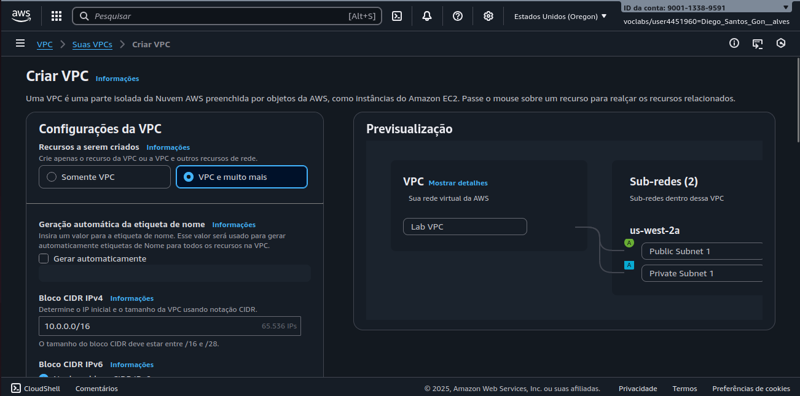

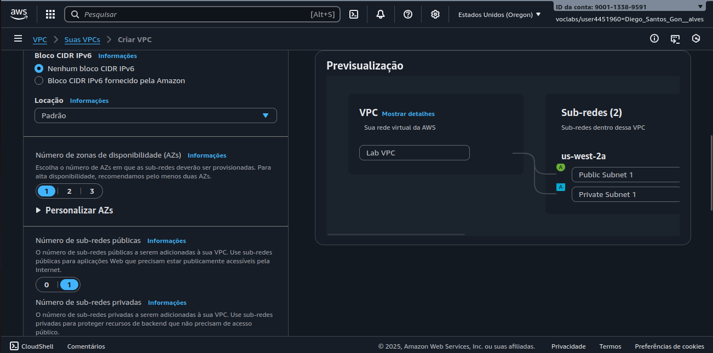

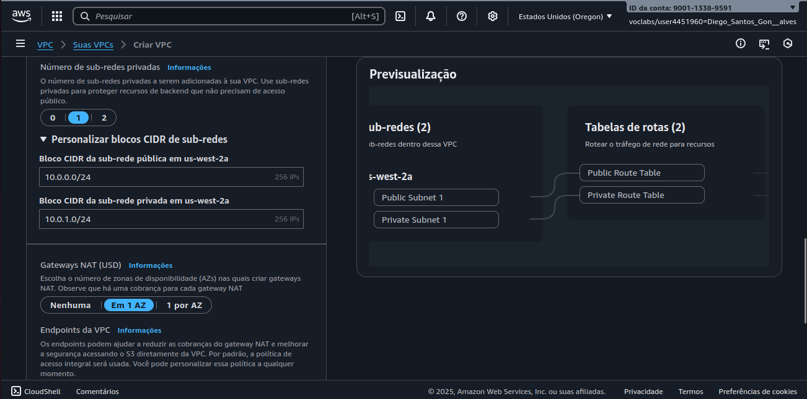

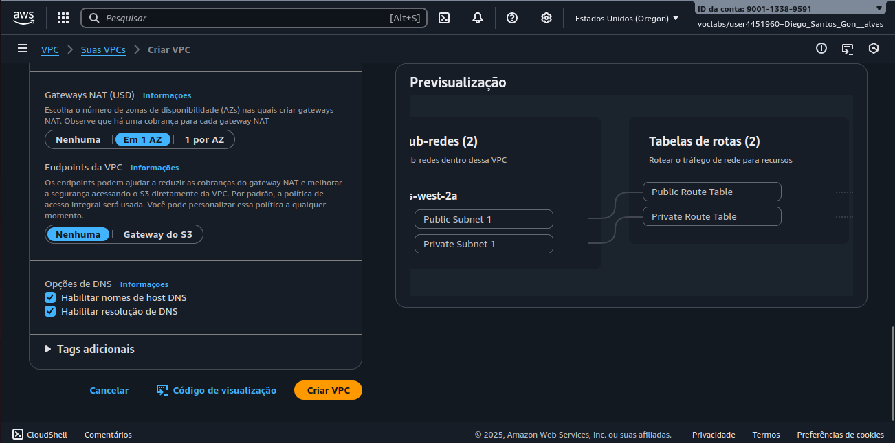

---

## 2️⃣ Criação das Sub-redes Adicionais (Alta Disponibilidade)

Para permitir alta disponibilidade, foram criadas mais duas sub-redes em outra Zona de Disponibilidade:

* **Public Subnet 2:** `10.0.2.0/24`
* **Private Subnet 2:** `10.0.3.0/24`

#### 📸 Criação das sub-redes:

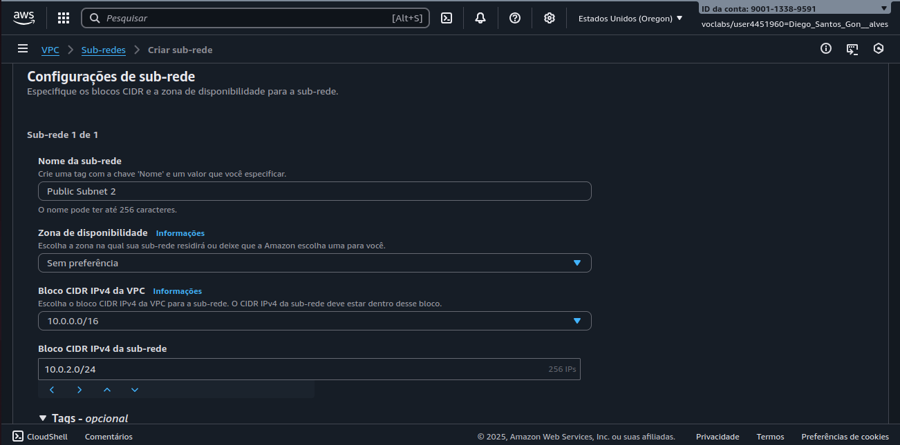

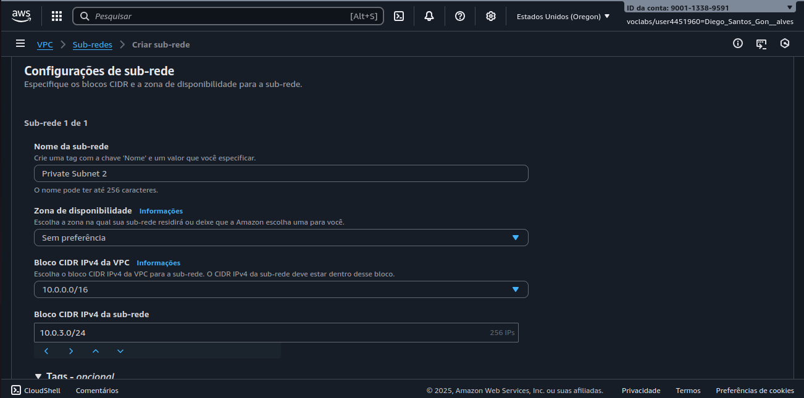

---

## 3️⃣ Associação às Tabelas de Rotas

Após criar as sub-redes, foi necessário associá-las às tabelas de rotas corretas:

* Public Subnet 2 → **Tabela de rota pública**
* Private Subnet 2 → **Tabela de rota privada**

#### 📸 Associação de rotas:

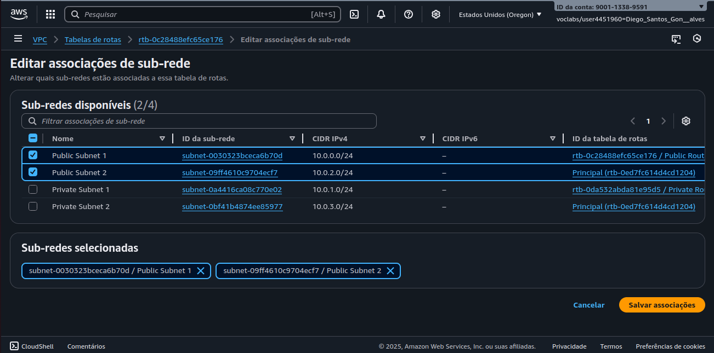

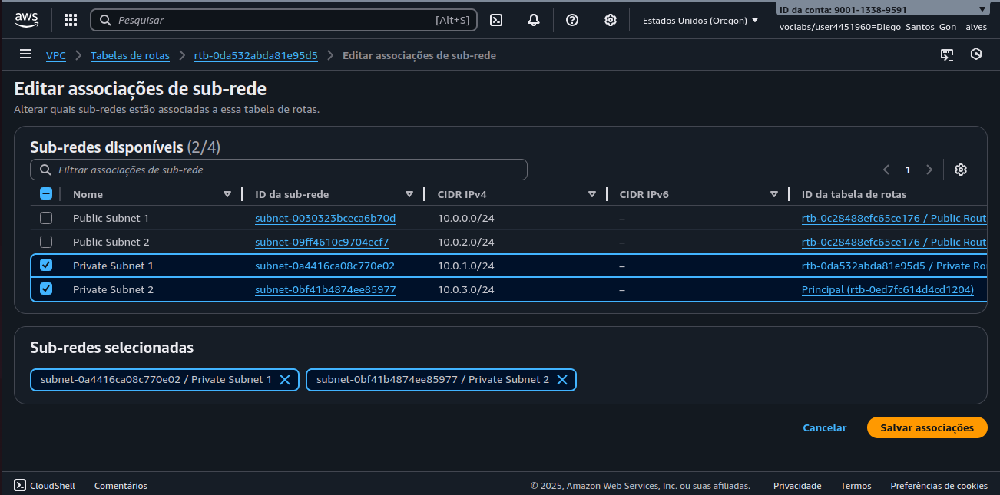

---

## 4️⃣ Criação do Security Group — *Web Security Group*

O Security Group foi configurado permitindo tráfego HTTP:

**Regras:**

* **Tipo:** HTTP
* **Origem:** Anywhere IPv4 (0.0.0.0/0)
* **Descrição:** Permit web requests

#### 📸 Criação do SG:

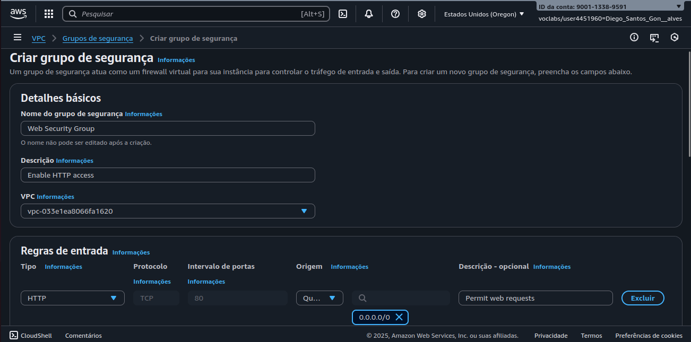

---

## 5️⃣ Lançamento da Instância EC2 + Instalação Automática do Servidor Web

A instância foi criada na **sub-rede pública**, com IP público habilitado.

**Configurações:**

* **Nome:** Web Server 1
* **AMI:** Amazon Linux 2
* **Instância:** `t3.micro`
* **Par de chaves:** vockey
* **Security Group:** Web Security Group
* **User Data:** instala Apache + baixa arquivos do laboratório

### 📄 Script de inicialização (User Data):

```bash
#!/bin/bash
# Instalar Apache e PHP
yum install -y httpd mysql php

# Baixar arquivos do laboratório
wget https://aws-tc-largeobjects.s3.us-west-2.amazonaws.com/CUR-TF-100-RESTRT-1/267-lab-NF-build-vpc-web-server/s3/lab-app.zip

unzip lab-app.zip -d /var/www/html/

# Iniciar serviço
chkconfig httpd on
service httpd start
```

#### 📸 Instância criada:

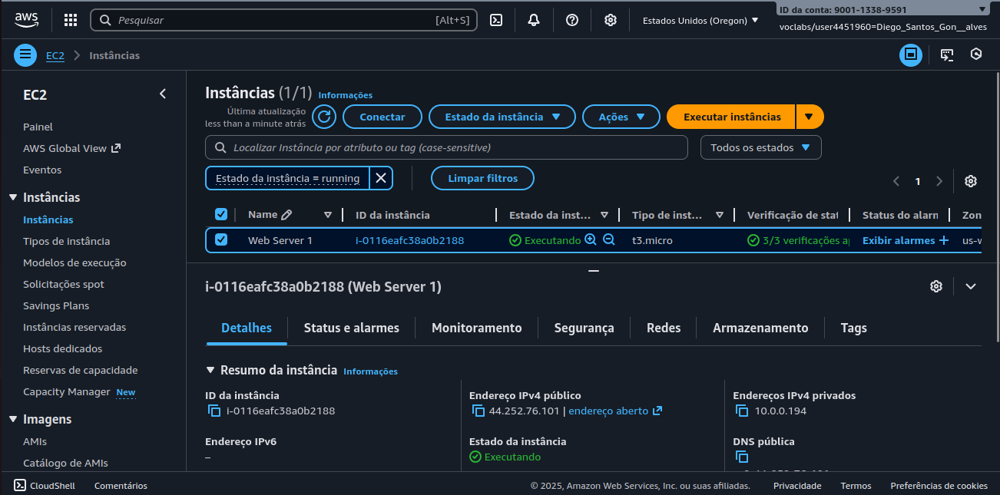

---

## 6️⃣ Teste do Servidor Web

Com o EC2 em execução, acessei o **Public IPv4 DNS** e a página do servidor foi carregada com sucesso.

#### 📸 Página funcionando:

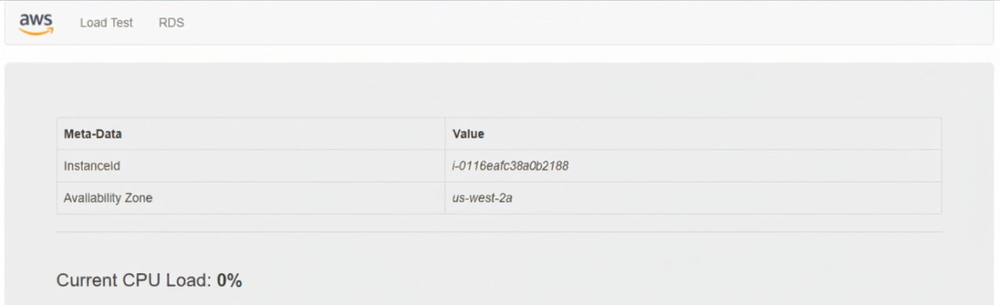

---

# 🏗️ Arquitetura Final Implantada

A estrutura final do laboratório ficou assim:

* VPC 10.0.0.0/16
* 2 Sub-redes públicas (10.0.0.0/24 e 10.0.2.0/24)
* 2 Sub-redes privadas (10.0.1.0/24 e 10.0.3.0/24)
* Internet Gateway
* NAT Gateway
* Tabelas de rotas pública e privada
* Security Group HTTP
* Instância EC2 rodando Apache

#### 📸 Arquitetura final:

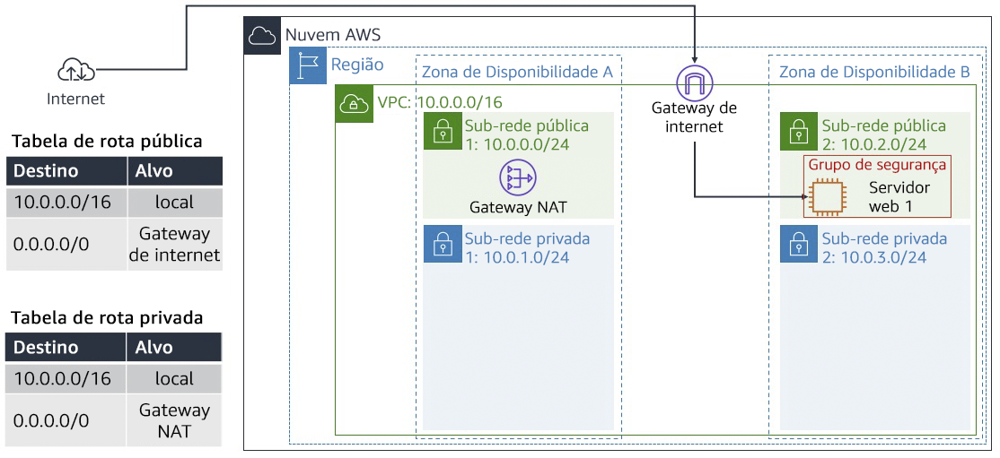

---

# 🔙 Recapitulação

Neste laboratório, foram realizados:

- ✔ Criação completa da VPC
- ✔ Configuração de arquitetura multi-AZ
- ✔ Ajustes de rotas e networking
- ✔ Criação de Security Group
- ✔ Lançamento de instância EC2 com servidor web
- ✔ Teste prático via navegador

---

⚠️ ***Observação***

Este laboratório foi realizado em um **ambiente sandbox da AWS**, disponibilizado apenas para fins educacionais. Nesse tipo de ambiente, o acesso é temporário e os **recursos são automaticamente encerrados e excluídos ao final da sessão**.

Informações como **Account ID ou nome do usuário do laboratório podem aparecer nos prints**, mas **não representam risco de segurança**, pois não pertencem a uma conta real e não permitem qualquer acesso externo.

